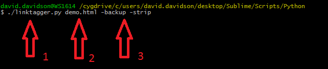
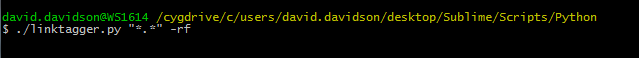

linktagger.py
=============

###Tag all your links at once!

This Python lets you tag files in bulk from the command line, no matter whether you&rsquo;re on Linux, Mac, or Windows. 

Just run it from the terminal (1), name the files you'd like to tag (2), and choose from three optional modes (3): `strip` removes preexisting GLT, `-backup` backs up everything it tags with the extension `.backup`, and `-rf` tags files not only in the target directory but in its subdirectories, too.

Like this:

The cool part is that, even on Windows, linktagger supports Unix-style wildcard expansion and (with `-rf`) iteration through subdirectories. Want to (for some reason) tag not only all the HTML files on your desktop, but also all the HTML files in its subdirectories?

In Unix terminals, put quotation marks around what you&rsquo;re tagging if you&rsquo;re tagging wildcards recursively&mdash;that way the shell won&rsquo;t expand the wildcards before the script can.

<strong>linktagger.py knows:</strong>
* To add GLT before section IDs, not after
* To fix previously tagged links that put a section ID anywhere but the very end of the&nbsp;URL
* To introduce GLT with &ldquo;&&rdquo;, not &ldquo;?&rdquo;, when it follows other link parameters that are already set off by a question&nbsp;mark
* Not to tag links that are already tagged
* Not to tag unanchored links, like those to a stylesheet or a typeface&nbsp;provider
* Not to tag relative links, like `<a href="#contact">`

That is, it&rsquo;ll tag, say, this: 
`<a href="http://www.test.com#contact?siteid=a">`

Like this: 
`<a href="http://www.test.com?siteid=a&utm_source=var1&utm_medium=var2`
`&utm_content=var3&utm_campaign=var4#contact">`