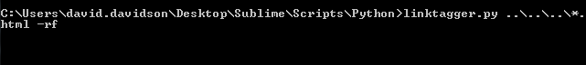
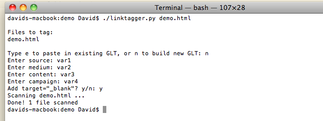

linktagger.py
=============

###Tag all your links at once!

Whether you&rsquo;re on Linux, Mac, or Windows, this Python script lets you add Google link tagging (GLT) in bulk from the command line. 

Just run it from the terminal (1), specify the files you&rsquo;d like to tag (2), and choose from three optional modes (3): `-strip` removes preexisting GLT, `-backup` backs up everything it tags (with the extension `.backup`), and `-rf` tags files not only in the target directory, but in all its subdirectories, too.

Like this:

The cool part is that, even on Windows, linktagger supports Unix-style wildcard expansion and (with `-rf`) iteration through subdirectories. Want to&mdash;for some reason&mdash;tag not only all the HTML files on your desktop, but also all the HTML files in its subdirectories?

In Unix terminals, put quotation marks around the target files if you&rsquo;re tagging wildcards recursively&mdash;that way the shell won&rsquo;t expand the wildcards before the script can.

After that, linktagger will prompt you for GLT parameters and take it from there!

<strong>linktagger.py knows:</strong>
* To add GLT before section IDs, not after
* To fix previously tagged links that put a section ID anywhere but the very end of the&nbsp;URL
* To introduce GLT with &ldquo;&&rdquo;, not &ldquo;?&rdquo;, when it follows other link parameters that are already set off by a question&nbsp;mark
* Not to tag links that are already tagged
* Not to tag unanchored links, like those to a stylesheet or a typeface&nbsp;provider
* Not to tag relative links, like `<a href="#contact">`

That is, it&rsquo;ll tag, say, this: 
`<a href="http://www.test.com#contact?siteid=a">`

Like this: 
`<a href="http://www.test.com?siteid=a&utm_source=var1&utm_medium=var2`
`&utm_content=var3&utm_campaign=var4#contact">`

####Requirements:
* Python 3+, which you can get <a href="https://www.python.org/downloads/">here</a>
* An accurate path to wher Python lives on your machine: on *nix, run `which python` (or, if you&rsquo;re running multiple versions, `which python3`) and then update the first line of the script
* Read/write/execute access to linktagger.py: on *nix, just cd into the script&rsquo;s directory and run `chmod 777 linktagger.py`

<strong>Enjoy!</strong>

P.S. On Linux? Check out linktagger.py&rsquo;s younger sibling, <a href="https://github.com/david-davidson/linkTagger.sh">linkTagger.sh</a>.